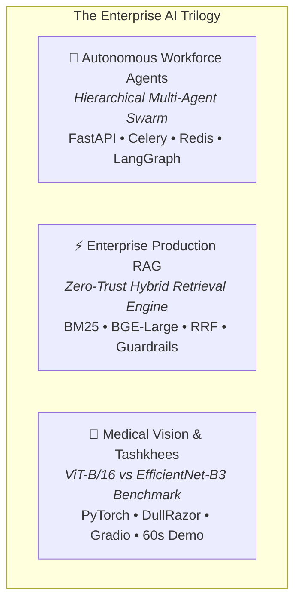

<div align="center">

# Yasir Alazmi
### Artificial Intelligence Engineer | Deep Learning, Autonomous Agents & Production RAG

[](https://www.linkedin.com/in/yasir-alazmi-471832436)
[](mailto:yasir.alazmi@outlook.sa)
[](https://github.com/Yasir-Alazmi)
[](https://github.com/Yasir-Alazmi)
[](https://github.com/Yasir-Alazmi)

</div>

---

## 🏛️ Executive Profile

Artificial Intelligence Engineer with a formal **Bachelor of Science in Artificial Intelligence** from the University of Hail and **BCG X GenAI Certification**. Specializing in the engineering lifecycle of enterprise AI: from **first-principles mathematical foundations** to **high-throughput asynchronous agent swarms**, **hybrid dense-sparse RAG systems**, and **clinical computer vision pipelines**.

- **Engineering Philosophy**: First-principles mathematical implementation, zero-friction reproducibility, deterministic testing (100% automated CI/CD coverage), and production-grade API architecture.
- **Core Specializations**: Autonomous Multi-Agent Orchestration, Production RAG Systems (Hybrid BM25 + Dense Search, Guardrails, Re-ranking), and Medical Computer Vision (Vision Transformers vs. CNNs).
- **Standards & Discipline**: Every public repository adheres to the **7 Pillars of Production AI Repositories** (Deterministic CI, pinned environments, automated regression test suites, zero-leakage security gates, and reproducible demos).

---

## 🚀 The Enterprise AI Trilogy (Flagship Systems)



| Flagship Repository | Domain & Architecture | Core Tech Stack | Automated CI Status |
| :--- | :--- | :--- | :---: |
| **[enterprise-workforce-agents](https://github.com/Yasir-Alazmi/enterprise-workforce-agents)** | **Autonomous Multi-Agent Workforce Orchestrator**<br/>Hierarchical supervisor-worker swarm orchestrating distributed asynchronous task lifecycles, human-in-the-loop validation, Redis task state cache, and zero-trust RBAC. | FastAPI, Celery, Redis, LangGraph, Docker, Pytest | [](https://github.com/Yasir-Alazmi/enterprise-workforce-agents/actions) |
| **[enterprise-production-rag](https://github.com/Yasir-Alazmi/enterprise-production-rag)** | **Enterprise Production RAG Architecture**<br/>Full-lifecycle hybrid retrieval platform combining deterministic BM25 lexical indexing with dense semantic vector search (RRF fusion), contextual re-ranking, and strict PII guardrails. | Python, FastAPI, BM25, Qdrant/Chroma, Docker, Pytest | [](https://github.com/Yasir-Alazmi/enterprise-production-rag/actions) |
| **[skin-lesion-classification](https://github.com/Yasir-Alazmi/skin-lesion-classification)** | **Clinical Vision Transformers & Tashkhees Benchmark**<br/>Comparative medical diagnostic benchmark evaluating ViT-B/16 vs EfficientNet-B3 across 7 dermatological pathologies, featuring DullRazor artifact removal and zero-friction 60s demo. | PyTorch, Vision Transformers, OpenCV, Gradio, Pytest | [](https://github.com/Yasir-Alazmi/skin-lesion-classification/actions) |

---

## 🔬 Applied Machine Learning & Scientific Foundations

| Repository | Focus Area | Technical Highlights | CI Badge |
| :--- | :--- | :--- | :---: |
| **[Comparative-Analysis-Healthcare](https://github.com/Yasir-Alazmi/Comparative-Analysis-of-Machine-Learning-Models-for-Healthcare-Diagnostics)** | **Clinical ML Benchmarking** | 10 algorithms benchmarked across 5 clinical diagnostic datasets with stratified 5-fold cross-validation and ROC-AUC evaluation. | [](https://github.com/Yasir-Alazmi/Comparative-Analysis-of-Machine-Learning-Models-for-Healthcare-Diagnostics/actions) |
| **[neural-network-from-scratch](https://github.com/Yasir-Alazmi/neural-network-from-scratch)** | **Deep Learning from First Principles** | Pure NumPy vectorized multi-layer perceptron, backward-pass calculus, analytical vs numerical gradient checking ($\text{error} < 10^{-7}$), and adaptive optimizers (Adam, RMSprop). | [](https://github.com/Yasir-Alazmi/neural-network-from-scratch/actions) |
| **[fake-news-detector](https://github.com/Yasir-Alazmi/fake-news-detector)** | **NLP / Semantic Classification** | Automated NLP linguistic verification pipeline with TF-IDF sublinear n-gram feature extraction and L2-regularized logistic classification. | [](https://github.com/Yasir-Alazmi/fake-news-detector/actions) |
| **[music-recommender](https://github.com/Yasir-Alazmi/music-recommender)** | **Recommender Systems & Discovery** | Content-based collaborative recommendation engine with multi-dimensional cosine similarity indexing and interactive Streamlit UI. | [](https://github.com/Yasir-Alazmi/music-recommender/actions) |

---

## 🛠️ Core Engineering Stack & Competencies

| Domain | Technologies & Frameworks |
| :--- | :--- |
| **Generative AI & LLM Systems** | LangChain, LangGraph, CrewAI, Retrieval-Augmented Generation (RAG), Hybrid Search (BM25 + Dense Vectors), Reciprocal Rank Fusion (RRF), Prompt Engineering, Semantic Caching, Hallucination Guardrails. |
| **Deep Learning & Computer Vision** | PyTorch, Torchvision, Vision Transformers (ViT), EfficientNet, CNNs, OpenCV, Albumentations, Scikit-Learn, NumPy, Pandas. |
| **Software Architecture & MLOps** | FastAPI, Celery, Redis, Docker, GitHub Actions (CI/CD), Pytest, Flake8, Black, Isort, Asynchronous Python (asyncio), Zero-Trust RBAC. |
| **Mathematical Foundations** | Vectorized Matrix Calculus, Backpropagation from First Principles, Gradient Checking, Numerical Optimization (Adam, SGD, Momentum), Stratified Cross-Validation. |

---

## 📊 Portfolio Engineering Health

```
All 7 Production Repositories Pass 100% Automated Continuous Integration
├── ✅ enterprise-workforce-agents                          [Passing]
├── ✅ enterprise-production-rag                            [Passing]
├── ✅ skin-lesion-classification                           [Passing]
├── ✅ Comparative-Analysis-of-Machine-Learning-Models      [Passing]
├── ✅ neural-network-from-scratch                          [Passing]
├── ✅ fake-news-detector                                   [Passing]
└── ✅ music-recommender                                    [Passing]
```

---

<div align="center">

### 📬 Connect & Collaborate

**Yasir Alazmi** — *AI Engineer & Applied Deep Learning Specialist*  
📧 [yasir.alazmi@outlook.sa](mailto:yasir.alazmi@outlook.sa) • 🌐 [LinkedIn](https://www.linkedin.com/in/yasir-alazmi-471832436) • 💻 [GitHub Profile](https://github.com/Yasir-Alazmi)

</div>
